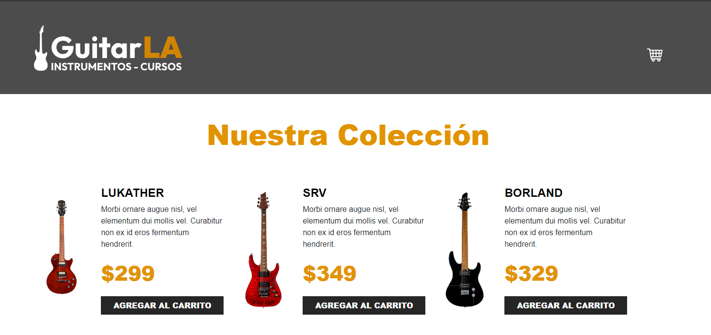
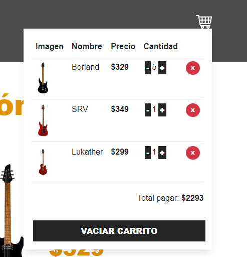

# Carrito de Compras con React y Typescript

Carrrito de compras con react y typescript

## Descripción del proyecto

¿Estás comenzando un proyecto pequeño, un desafío de programación o un tutorial, y necesitas una forma rápida y sencilla de crear documentación básica? ¡Esta plantilla README minimalista es para ti!

## Capturas de Pantalla del Proyecto

Incluir capturas de pantalla o imágenes que muestren el proyecto en funcionamiento.


Vista inicio de la aplicación.


Vista del carrito de compras

## Prerrequisitos o Dependencias

Lista de software y herramientas, incluyendo versiones, que necesitas para instalar y ejecutar este proyecto:

- React

## Instalación del Proyecto

Una guía paso a paso sobre cómo configurar el entorno de desarrollo e instalar todas las dependencias.

```bash
# git clone git@github.com:hernandw/guitarla-ts.git
```

instalamos dependencias 

```bash
# npm i 
```

## Instrucciones para Ejecutar el Proyecto

Instrucciones para ejecutar el proyecto una vez instalado.

```bash
# npm run dev
```


Este proyecto está bajo la Licencia MIT - ve el archivo [license.md](LICENSE) para detalles

---


⌨️ con ❤️ por [Williams Hernández](https://github.com/hernandw) 😊
